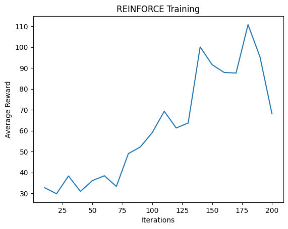
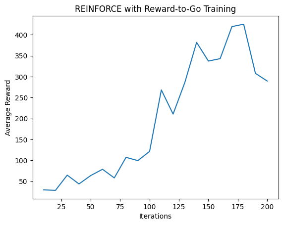
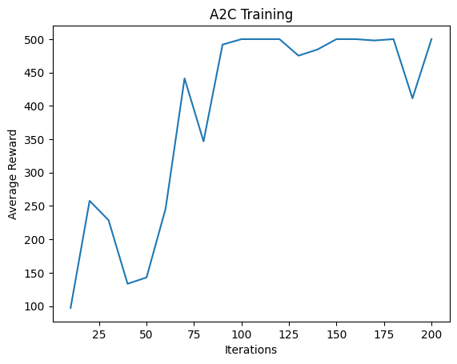

## REINFORCE

Average reward of the final trained policy network (value of evaluate(100) ) is 96.68

Discuss how the reward increases as training progresses.

In the initial stages, the reward fluctuates within a low range (30-40), after 75 iterations, the reward begins to increase, and we can observe a steady increase between 75th iteration to 130 iterations. During this period, the network consistently improves, indicating that it is learning to make better decisions. After that the average reward achieved the peak of around 100. This shows that the network learned to make better decisions. However, in the final iterations, the reward begins to decrease, it maybe because the exploration noise, the instability of the policy, or overfitting.

## Reward-to-go

Average reward of the final trained policy network (value of evaluate(100) ) is 296.79.

Using the reward-to-go method in the REINFORCE algorithm significantly improves the training performance. The reward-to-go method reduces variance of policy gradient, thus it has a significant increase of reward than the original discounted reward method. After around 75 iterations, the reward is more than 100, and continue to increase to 400, it's significantly larger than the original method which has a reward of only around 100. This higher performance shows that the reward-to-go method enables the network to achieve a better policy for balancing the pole.

## Advantage Actor-Critic

Average reward of the final trained policy network (value of evaluate(100) ) is 500.0

The A2C method performs much betther than the original method, and has a faster speed to reach the highest reward. The reward quickly increases around the 50th iteration, then stabilizes between 450 and 500, reaching near-optimal performance. Compare to reward-to-go method, which achieves an average reward of around 400, A2C have higher reward and faster convergence speed, which shows that A2C can reduce the variance in updates better.